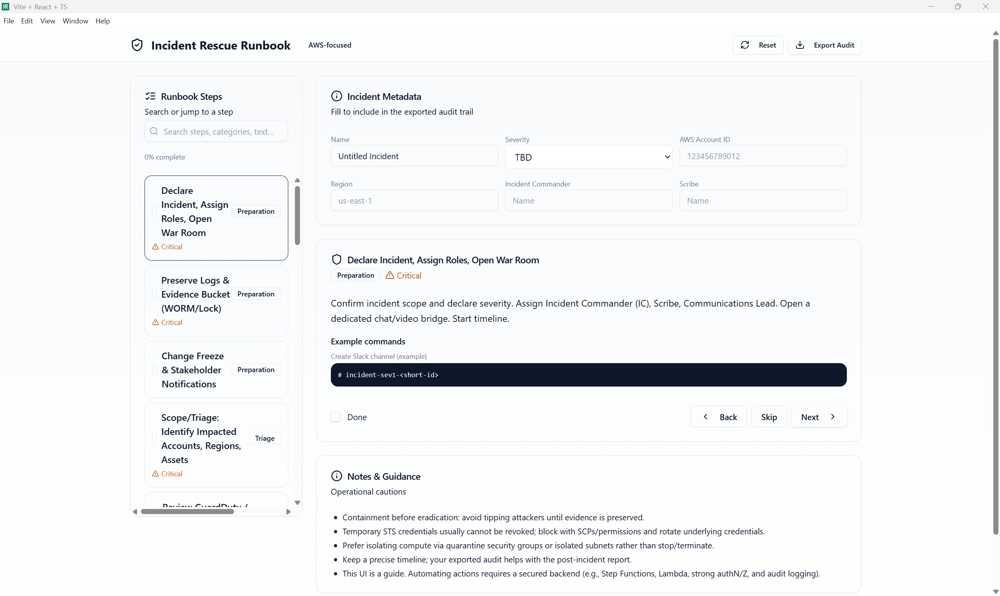

# 🚨 AWS Incident Rescue Runbook (Desktop App)

An Electron + React + Vite desktop application that provides a structured, step-by-step runbook for cloud incident response, with a focus on **AWS environments**.  
This tool helps engineers and responders **declare, triage, preserve, and investigate incidents** efficiently while maintaining audit readiness.

---

## 📖 Overview
The **Incident Rescue Runbook** streamlines the incident response process by offering:
- Predefined **incident steps** (declaration, logging, containment, evidence preservation, communication).
- **Audit metadata capture** (severity, AWS account ID, incident commander, notes).
- **Exportable audit reports** for compliance and postmortems.
- A **clean, offline-first desktop experience** packaged as a `.exe`.

This project demonstrates how cloud engineers can operationalize best practices into **tools** that improve **response speed, accuracy, and repeatability**.

---

## ✨ Features
- 📝 Guided runbook steps with context and example commands.
- ⚠️ Severity classification & metadata tracking.
- 📊 Exportable audit logs (JSON/CSV).
- 🎨 Clean UI built with **React + TailwindCSS**.
- 🖥️ Cross-platform desktop app powered by **Electron**.
- 🔒 Local-only (no external dependencies required during runtime).

---

## 🚀 How to Run (Development Mode)
```bash
# clone the repository
git clone https://github.com/<your-username>/incident-rescue-runbook.git
cd incident-rescue-runbook/runbook-ui

# install dependencies
npm install

# run in dev mode
npm run dev
```

## Open the app at:
👉 http://127.0.0.1:5173

## How to Build Executable (.exe for Windows)
```bash
# close any previous instances
taskkill /IM "Incident Rescue Runbook.exe" /F 2>$null

# build production web assets
npm run build:web

# package into .exe (installer + portable)
npm run build:win
```

Resulting files will be in the `dist/` folder:

* `Incident Rescue Runbook Setup <version>.exe` → Installer

* `runbook-ui <version>.exe` → Portable (no installation required)

## 📂 Project Structure
```csharp
runbook-ui/
 ├── electron/           # Electron main & preload scripts
 ├── src/                # React components
 ├── public/             # Static assets (icons, logos)
 ├── dist/               # Build outputs
 ├── package.json        # Project metadata & scripts
 └── vite.config.ts      # Vite config
```

## 📸 Screenshot

Here’s what the app looks like running in Windows:




## Author

Nasim Bayati